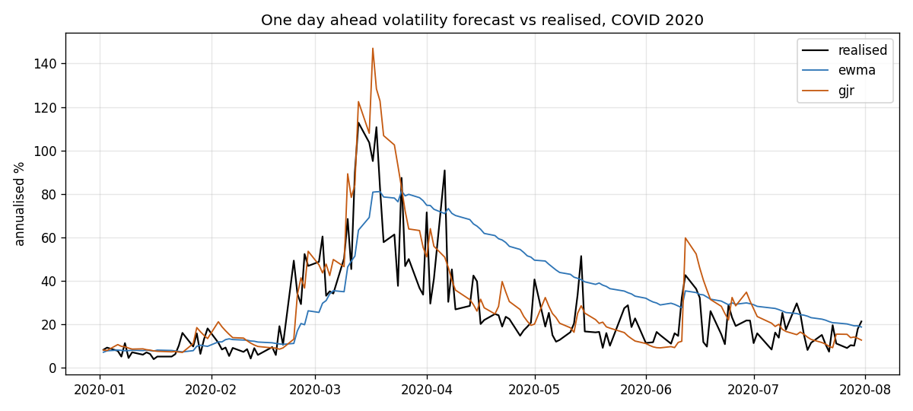
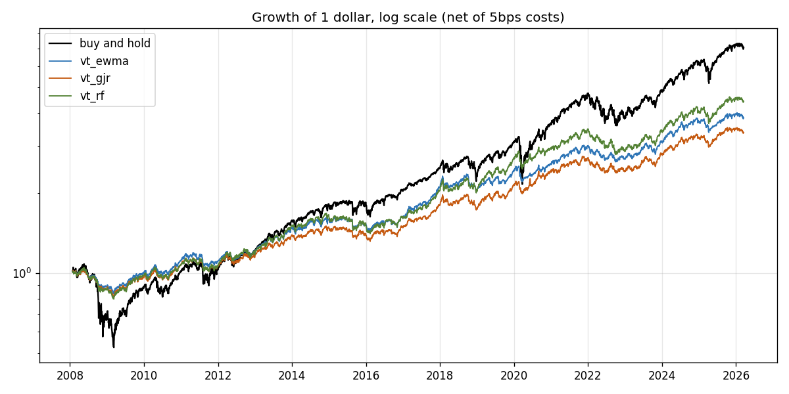
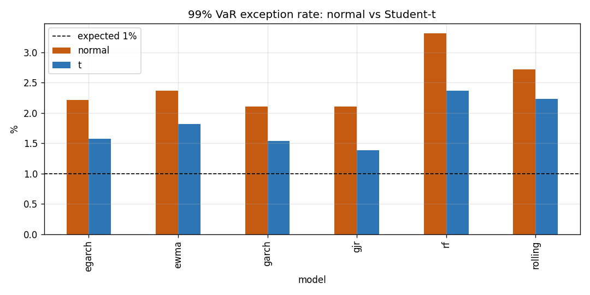
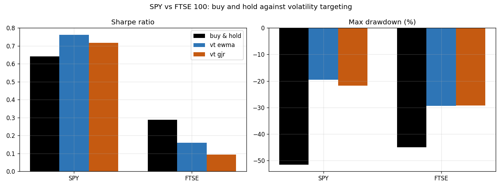

# Volatility Forecasting and Strategy Backtesting

Forecast how much a stock index will move, use that forecast to run a risk managed
strategy, and then check the same forecasts the way a bank's risk team checks a Value
at Risk model.

Six volatility models compete. Each one is turned into a volatility targeting
strategy and backtested against buy and hold, and each one is also graded as a one
day VaR model with the Kupiec and Christoffersen tests. The interesting part is that
the three contests do not crown the same winner.

---

## Problem statement

You cannot see volatility directly. You only ever see returns, and volatility comes
in waves: quiet spells, then bursts. So it has to be forecast, and a forecast is only
worth having if it does two jobs. It should size a position so your risk stays where
you want it, and it should tell you how bad a bad day could get.

That gives three questions, asked here on 21 years of SPY data:

1. Which model predicts next day volatility most accurately?
2. Feed that forecast into a position sizing rule. Does the more accurate forecast
   actually make more money per unit of risk, or does accuracy not pay?
3. Treat each forecast as a one day VaR model. Which one gets the loss line right?

The three answers point to different models. That is the main result, and section 4
shows it holds up on a second index too.

---

## Data

| | |
|---|---|
| Asset | SPY, the S&P 500 ETF |
| Frequency | Daily open, high, low, close |
| Full sample | Jan 2005 to Mar 2026, 5337 trading days |
| Evaluation sample | Jan 2008 to Mar 2026, 4563 days (after warm up) |
| Source | Yahoo Finance, cached in the repo |

SPY is the fund, not the index, and that is deliberate. You can trade a fund, so a
strategy that trades SPY is one you could actually run. It also keeps this project
separate from earlier work that used the index itself.

The volatility yardstick is the Garman and Klass (1980) estimator, which reads
volatility off the daily price range. It misses the overnight gap, so it comes out a
little low for a close to close strategy. One constant, fitted only on the first two
years, lifts it onto the traded scale before anything else uses it. Nothing in the
evaluation period is used to fit that constant, so there is no peeking.

---

## Methods

**The forecasts.** Every model predicts tomorrow's volatility from today's
information, and every model is scored out of sample with walk forward testing.

- Rolling: a 21 day standard deviation of returns. The obvious baseline.
- EWMA: the RiskMetrics estimate, which fades old data out smoothly.
- GARCH, GJR-GARCH, EGARCH: the econometric family, fitted with the `arch` package,
  refit every 21 days and rolled forward in between.
- Random Forest: a machine learning model on the HAR features (volatility over the
  last day, week and month).

**The strategy.** Volatility targeting. Aim for 10 percent volatility a year: hold
more SPY when the forecast is calm, less when it is stormy, cap the leverage at 1.5,
and keep the rest in cash. Costs of 5 basis points are charged on every change in
position, so the results are after trading friction.

**The VaR check.** Turn each forecast into a one day loss line at the 99 and 95
percent levels, under both a normal and a fat tailed Student-t assumption. Count the
breaches, then run Kupiec (is the count right) and Christoffersen (are the breaches
spread out).

**One more test.** Diebold-Mariano, which says whether a gap in forecast accuracy is
real or just luck.

---

## Key results

### 1. Which forecast is most accurate

GJR-GARCH wins, and Diebold-Mariano says the win is real, not noise. The models that
allow a fall to spike volatility more than a rise do best, which fits how equity
markets actually behave. The plain rolling window comes last by a distance.

| Model | QLIKE | MSE (1e-5) | MAE (1e-3) |
|---|---|---|---|
| gjr | 0.388 | 2.59 | 3.43 |
| egarch | 0.404 | 2.47 | 3.36 |
| garch | 0.412 | 2.85 | 3.61 |
| rf | 0.448 | 2.98 | 3.21 |
| ewma | 0.456 | 3.39 | 3.84 |
| rolling | 0.511 | 3.71 | 3.90 |



### 2. Does the better forecast make a better strategy

Not really, and that is worth sitting with. Volatility targeting works: it roughly
halves the worst drawdown, from -51 percent to about -20 percent, and lifts the
Sharpe ratio from 0.64 to as high as 0.77. Every version lands near the 10 percent
volatility target, so the sizing does its job.

But the best forecaster does not win here. The simple rolling and EWMA forecasts give
the highest Sharpe. GJR-GARCH, the accuracy champion, reacts to every wobble, so it
trades about twice as much, and the extra trading costs eat the edge. A sharper
forecast is not the same as a better decision.

| Strategy | Ann return | Ann vol | Sharpe | Max drawdown | Ann turnover |
|---|---|---|---|---|---|
| buy_and_hold | 11.4% | 19.9% | 0.642 | -51.5% | 0.1 |
| vt_rolling | 8.2% | 11.0% | 0.770 | -20.0% | 7.2 |
| vt_ewma | 7.7% | 10.5% | 0.763 | -19.6% | 5.9 |
| vt_garch | 7.3% | 10.0% | 0.757 | -21.1% | 12.1 |
| vt_rf | 8.6% | 11.7% | 0.758 | -24.0% | 29.5 |
| vt_gjr | 7.0% | 10.1% | 0.717 | -21.8% | 13.0 |
| vt_egarch | 6.1% | 10.3% | 0.626 | -26.8% | 15.6 |



Buy and hold ends higher in pounds, because it simply took more risk in a rising
market. The strategy earns its keep in the crashes, where it sidesteps most of the
damage. Here is 2008 and the two later shocks:

| Window | Buy and hold return | Buy and hold max DD | vt_gjr return | vt_gjr max DD |
|---|---|---|---|---|
| GFC 2008 to 2009 | -26.7% | -46.0% | -8.8% | -15.6% |
| COVID 2020 | -7.7% | -33.7% | -3.0% | -9.9% |
| Bear 2022 | -18.2% | -24.5% | -10.3% | -12.4% |

### 3. Which forecast is the best risk model

Now the GARCH family pulls ahead. As a 99 percent VaR under a normal assumption every
model breaches too often, 2 to 3 percent of the time instead of 1 percent, because
real returns have fatter tails than a bell curve. Swap in a Student-t tail and the
breach rates fall back towards 1 percent. GJR-GARCH is the only model that gets there
cleanly: 1.4 percent breaches, spread out, and it passes the combined test.

| Model | 99% normal rate | 99% Student-t rate | independence p (t) | cc p (t) |
|---|---|---|---|---|
| gjr | 2.1% | 1.38% | 0.89 | 0.050 |
| garch | 2.1% | 1.53% | 0.03 | 0.000 |
| egarch | 2.2% | 1.58% | 0.90 | 0.001 |
| ewma | 2.4% | 1.82% | 0.02 | 0.000 |
| rolling | 2.7% | 2.24% | 0.01 | 0.000 |
| rf | 3.3% | 2.37% | 0.39 | 0.000 |



Look at the independence column even where the coverage fails. The GARCH family's
breaches are scattered through time; the rolling and EWMA breaches clump together in
crises, which is the worst time for a risk model to go quiet. At the gentler 95
percent level a normal tail is fine and plain GARCH passes cleanly, so it really is
just the extreme tail that breaks the bell curve.

### 4. Second index: FTSE 100

The whole thing was rerun on the FTSE 100 as an out of sample check. Three findings
survive the move, one does not.

Survives:

- GARCH family best, rolling worst. On the FTSE the order is GARCH, then GJR, then
  EGARCH.
- GJR-GARCH with a Student-t tail is again a valid 99 percent VaR, and again the
  GARCH breaches stay spread out while the simple models clump.
- Volatility targeting still cuts the drawdown, from about -45 percent to -27 percent.

Does not survive:

- On the FTSE, targeting volatility does not lift the Sharpe ratio. Buy and hold sits
  at 0.29, the best strategy version only reaches 0.16. The FTSE barely rose over
  these years, about 3.6 percent annually, so trimming exposure in calm spells costs
  more in lost return than it saves in risk. The strategy's payoff depends on the
  asset, even though its risk control works everywhere.

| Asset | Best forecast | Buy & hold Sharpe | Best vol-target Sharpe | Improves Sharpe | Buy & hold max DD | Best vol-target max DD | GJR-t 99% VaR valid |
|---|---|---|---|---|---|---|---|
| SPY | gjr | 0.64 | 0.77 | yes | -52% | -20% | yes |
| FTSE | garch | 0.29 | 0.16 | no | -45% | -27% | yes |



### Putting the three answers together

The most accurate forecast (GJR-GARCH) is not the best trading engine, where the
plain forecasts win on Sharpe, but it is clearly the best risk model, the only one
whose 99 percent VaR holds up. Different jobs, different winners. That is the whole
point of validating a model for the use it is actually put to, rather than ranking
models on a single number.

---

## Repository layout

```
.
├── data/
│   ├── raw/                        spy.csv and ftse.csv
│   └── processed/                  result tables (FTSE under ftse/)
├── src/
│   ├── data_loader.py              load and clean OHLC, log returns
│   ├── features.py                 Garman-Klass volatility, HAR features
│   ├── forecasts.py                the six forecasts and the walk forward loop
│   ├── strategy.py                 volatility targeting position sizing
│   ├── backtest.py                 returns, Sharpe, drawdown, turnover, costs
│   ├── var_model.py                VaR, Kupiec and Christoffersen tests
│   └── evaluation.py               QLIKE, MSE, MAE, Diebold-Mariano
├── notebooks/                      01 data, 02 forecasts, 03 strategy, 04 VaR
├── reports/figures/                saved figures (FTSE under ftse/)
├── run_pipeline.py                 runs one asset end to end
├── compare_assets.py               builds the SPY vs FTSE comparison
└── EXPLAINER.md                    a plain English walkthrough of the whole project
```

---

## Running it

```bash
python -m venv .venv
source .venv/bin/activate                # Windows: .venv\Scripts\activate
pip install -r requirements.txt

python run_pipeline.py                                          # SPY
python run_pipeline.py --asset ftse --data data/raw/ftse.csv    # FTSE 100
python compare_assets.py                                        # SPY vs FTSE
```

The result tables ship with the repo, so the notebooks open with everything already
filled in. Open them in order, 01 to 04. Add `--rebuild` to refit the GARCH models
from scratch, which takes a couple of minutes.

New to the ideas here? Start with **EXPLAINER.md**. It walks through every term and
every finding in plain language, no finance background assumed.

---

## What this shows

- Volatility forecasting with both econometric models (the GARCH family, EWMA) and a
  machine learning model (Random Forest on HAR features).
- Honest out of sample testing, QLIKE loss, and the Diebold-Mariano significance test.
- A full backtest: volatility targeting, Sharpe, drawdown, turnover, costs, and a look
  at how it behaves through each crisis.
- Market risk validation: building a one day VaR and backtesting it with the Kupiec
  and Christoffersen tests, under both normal and fat tailed assumptions.
- Clean, commented code, a reproducible pipeline, and results reported straight,
  including where the strategy does not work.

---

## References

- Bollerslev, T. (1986) Generalized autoregressive conditional heteroskedasticity.
- Christoffersen, P. (1998) Evaluating interval forecasts.
- Corsi, F. (2009) A simple approximate long memory model of realized volatility.
- Diebold, F.X. and Mariano, R.S. (1995) Comparing predictive accuracy.
- Garman, M.B. and Klass, M.J. (1980) On the estimation of security price volatilities from historical data.
- Glosten, L.R., Jagannathan, R. and Runkle, D.E. (1993) On the relation between the expected value and the volatility of the nominal excess return on stocks.
- Kupiec, P. (1995) Techniques for verifying the accuracy of risk measurement models.
- Nelson, D.B. (1991) Conditional heteroskedasticity in asset returns.
- Patton, A.J. (2011) Volatility forecast comparison using imperfect volatility proxies.

---

*Built with Python, pandas, numpy, arch, scikit-learn, scipy and matplotlib.*
